# Starter-Kit

This is a framework for building single-page web apps with [Angular 2](https://angular.io/), [Flask](http://flask.pocoo.org/), [PostgreSQL](https://www.postgresql.org/), and [Heroku](https://www.heroku.com/).

<p align="center">
  <a href="" target="_blank">
    </img>
  </a>
</p>

## Table of Contents
* [Quickstart](#quickstart)
* [Overview](#overview)
* [Dependencies](#dependencies)
* [File Structure](#file-structure)
* [Database](#database)
* [Setting Up the Database](#setting-up-the-database)
* [Deployment](#deployment)
* [Resources for Learning](#resources-for-learning)
* [Additional Helpful Tools](#additional-helpful-tools)
* [Frequently Asked Questions](#frequently-asked-questions)

## Quickstart

#### 1. Download and install the following software:
+ [OpenSSH](https://sourceforge.net/projects/sshwindows/?source=typ_redirect) (required - for Windows users only)
+ [git](https://git-scm.com/downloads) (required)
+ [VirtualBox](https://www.virtualbox.org/wiki/Downloads) (required)
+ [Vagrant](https://www.vagrantup.com/downloads.html) (required)

#### 2. Open the command line (terminal) and type the following command:
>
```bash
git clone https://github.com/maangulo12/starter-kit.git
```


#### 3. Change directory into the downloaded project:
>
```bash
cd starter-kit
```
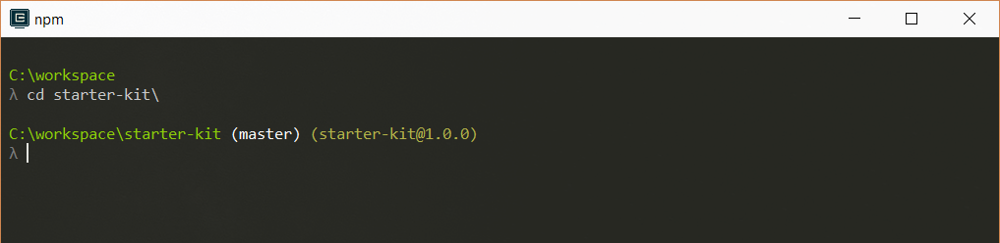

#### 4. Run vagrant to setup the development environment:
>
```bash
vagrant up
```
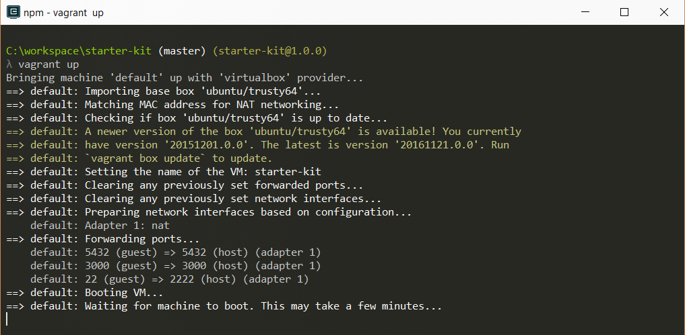
*This step may take some time. Please be patient.*

#### 5. SSH into the virtual machine:
>
```bash
vagrant ssh
```

*It may ask you to enter a passphrase and a password.* 
```
Passphrase for key: (just press Enter)
Password: vagrant
```

#### 6. Change directory into the vagrant folder:
>
```bash
cd /vagrant/
```


#### 7. Run the task runner to run the application:
>
```bash
gulp
```


#### 8. Open [http://localhost:3000](http://localhost:3000):


## Overview

The Starter-Kit aims to provide a starting template with all the tools necessary for 
building single-page applications on the cloud. The project consists of the following
stack:

+ **PostgreSQL** as the database engine for storing the data.
+ **Python** as the server-side language and **Flask** as the framework for building the RESTful API.
+ **Angular 2** as the client-side framework for creating the client application that runs in the web browser.
+ **Heroku** as the platform/service for deploying the application to the cloud.

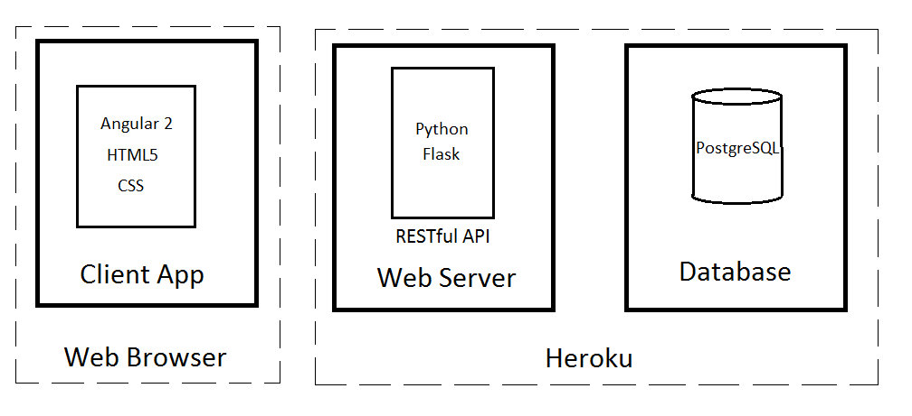

## Dependencies 

Before getting started with the Starter-Kit, a few dependencies need to be installed first.
These dependencies include:

+ [OpenSSH](https://sourceforge.net/projects/sshwindows/?source=typ_redirect) (required - for Windows users only)
+ [git](https://git-scm.com/downloads) (required)
+ [VirtualBox](https://www.virtualbox.org/wiki/Downloads) (required)
+ [Vagrant](https://www.vagrantup.com/downloads.html) (required)

*Download these if you have not already download them.*

You will need to install these dependencies so that the Starter-Kit works accordingly. The Starter-Kit
uses both **Vagrant** and **VirtualBox** to setup and configure a virtual machine that will allow you to run 
the application inside the virtual machine. This virtual machine is configured using a *Vagrantfile* that 
will install dependencies inside the virtual machine in order to run the application.
Notice that the application will run inside the virtual machine, and not your local computer. Vagrant
will also install **PostgreSQL** and will setup the database for your application. A picture
of how Vagrant and VirtualBox work together is illustrated below.

<p align="center">
    </img>  
</p>

For more information about Vagrant, go to this [link](https://www.vagrantup.com/docs/why-vagrant/).

## File Structure
```
starter-kit/
 ├──backend/                   * our backend (server-side) code folder
 |   ├──__init__.py            * our main module for this app
 |   ├──config.py              * our app config module
 |   ├──models.py              * our database models
 │   ├──view.py                * our app views
 │   │
 │   └──api/                   * our API folder
 │       └──v1/                * our API v1 folder
 |           ├──__init__.py    * our API v1 package module
 |           ├──auth.py        * implements the API v1 endpoint for authentication
 │           └──endpoints.py   * implements the API v1 endpoints 
 │                               (this module can be broken into multiple modules or packages)
 |
 ├──docs/                      * contains documentation about the starter-kit
 |   └──all files                (this folder should be deleted after downloading the starter-kit)
 │
 ├──frontend/                  * our frontend (client-side) code folder
 |   ├──app/                   * our Angular 2 app folder (all the app components go in here)
 |   ├──assets/                * our assets folder (contains all CSS, images, and JavaScript files)
 |   ├──build/                 * our build folder (contains all the compiled files)
 |   ├──index.html             * our index (initial) page
 │   └──systemjs.config.js     * our SystemJS config file
 │
 ├──local/                     * our local config folder
 │   ├──pg_hba.conf            * config file used by Vagrant for authenticating to the local database
 │   └──pg_ident.conf          * config file used by Vagrant for authenticating to the local database
 |
 ├──.gitignore                 * specifies files that git should ignore
 ├──app.json                   * specifies information required to run the app on Heroku
 ├──gulpfile.js                * our build system file for automating tasks
 ├──manage.py                  * our Python script for performing commands
 ├──package.json               * specifies our Node dependencies
 ├──Procfile                   * what Heroku uses to deploy the app
 ├──README.md                  * README file 
 ├──requirements.txt           * specifies our Python dependencies
 ├──runtime.txt                * specifies our Python runtime version
 ├──server.py                  * our Python script for running the app
 ├──tsconfig.json              * specifies options for the TypeScript compiler  
 ├──typings.json               * specifies packages needed by the TypeScript compiler
 └──Vagrantfile                * what Vagrant uses to configure the virtual machine
```

## Database

We use **PostgreSQL** as the database engine/server for this Starter-Kit.
PostgreSQL is an *object-relational database* that enables us to store data 
securely and retrieve data using the relational database model. For more information
about PostgreSQL, go to this [link](https://en.wikipedia.org/wiki/PostgreSQL).

In this Starter-Kit, the PostgreSQL database is installed inside the virtual machine
(thanks to Vagrant). The database can be viewed through a client application 
using the crendentials below.

### PostgreSQL Database
    Host:     localhost
    Port:     5432
    Database: app_db
    Username: postgres
    Password: password

### pgAdmin
pgAdmin is a free to use, open-source management, and administration client for PostgreSQL.
pgAdmin can be used to manage and view your database, tables, and data. To download pgAdmin, 
go to this [link](https://www.pgadmin.org/).

### Connecting to PostgreSQL Database using pgAdmin

#### 1. After downloading pgAdmin, open the application and click on "Add New Server."
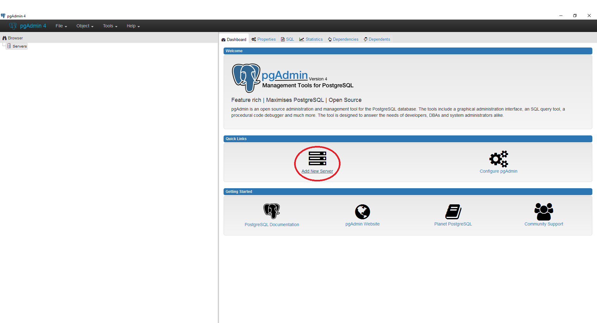

#### 2. Add a name for the server.
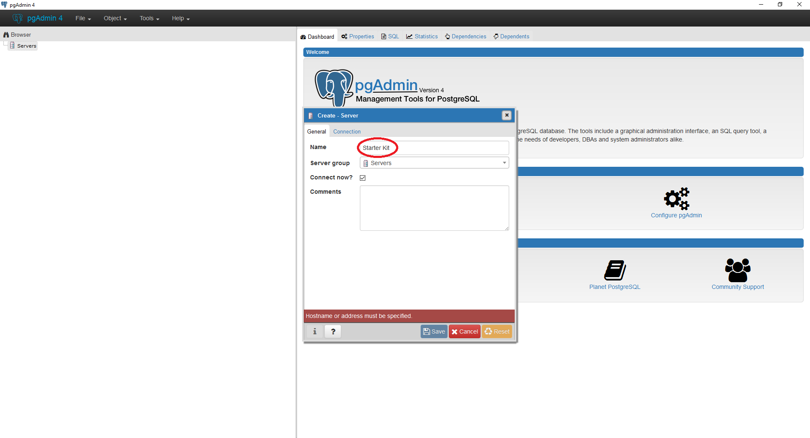

#### 3. Click on the "Connection" tab.
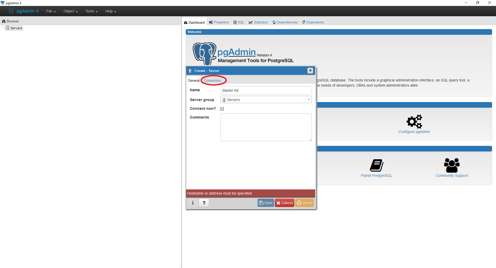

#### 4. Enter all the fields and click "Save."
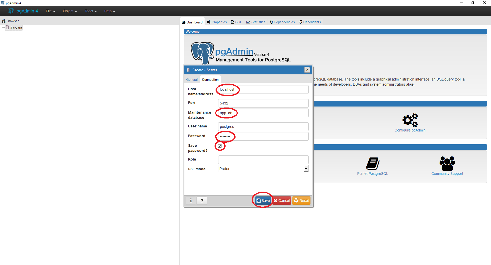

#### 5. If the connection is successful, the database will appear on the left side of the screen.
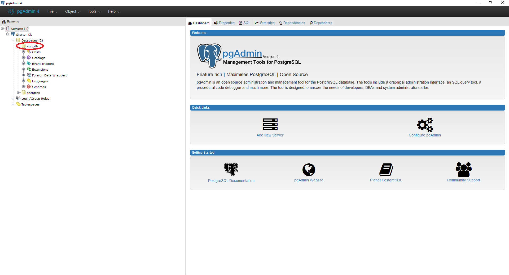

## Setting up the Database
In this Starter-Kit, we use a script called **manage.py** to automate the process of setting up 
the database. This script is used to automatically create the tables in the database from 
the Python models. Here is how you can use it.

### Creating the tables from the Python models
After implementing all the Python models, use this command to create the tables in the database. 
Make sure you are inside the vagrant folder in the virtual machine.
>
```bash
python3 manage.py create
```

*You can view the new tables created in pgAdmin.*
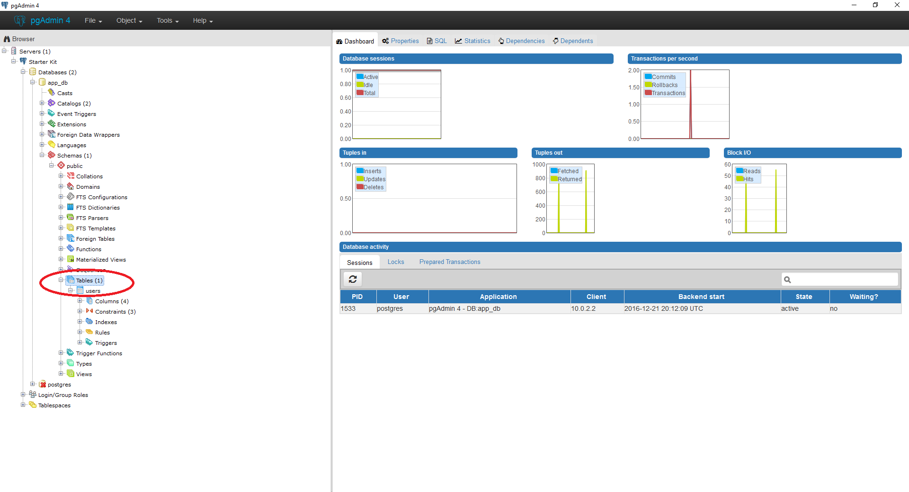

### Dropping the tables from the database
Use this command to drop all the tables from the database. 
Make sure you are inside the vagrant folder in the virtual machine.
>
```bash
python3 manage.py drop
```
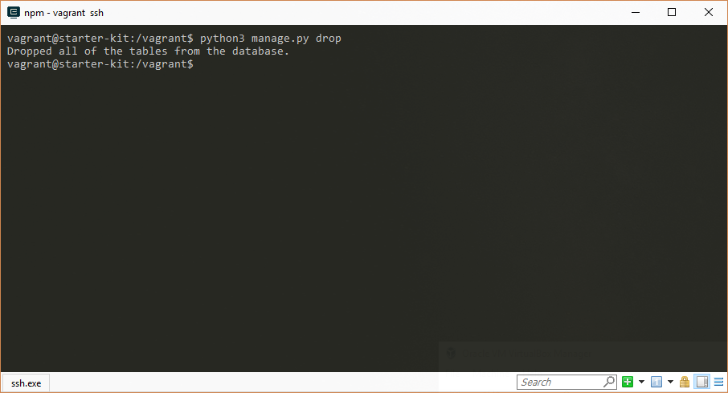
*You can check if the tables were dropped in pgAdmin.*
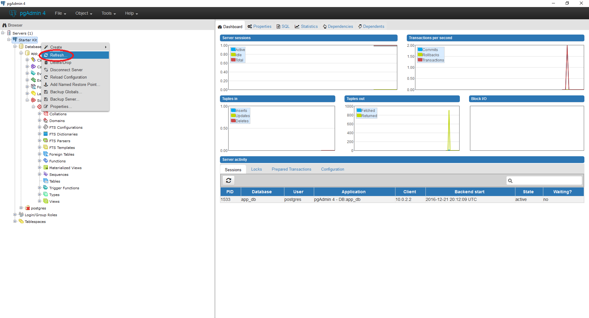

## Deployment

To deploy the app on Heroku, first create an account on [Heroku](https://www.heroku.com/).

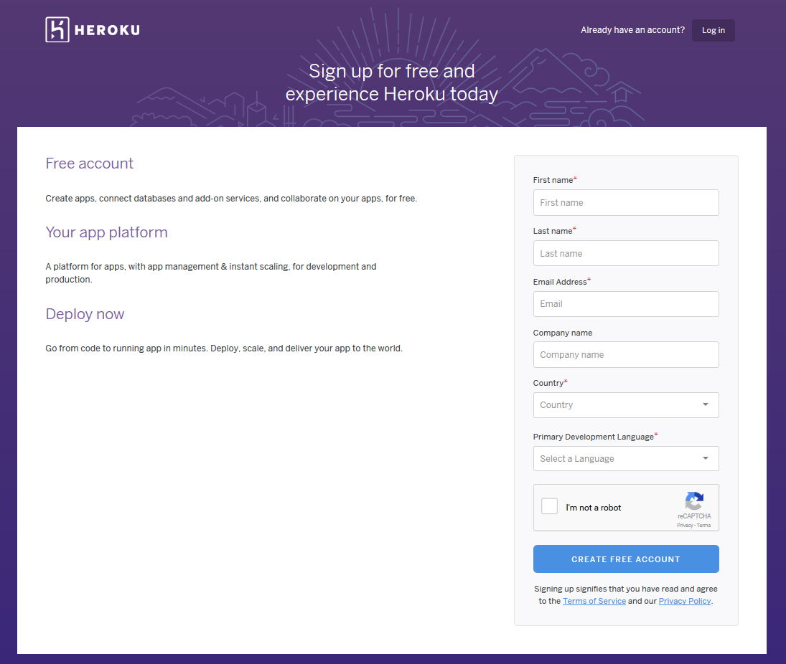

After creating the account, open the command-line and type the following 
and make sure you are inside the virtual machine.
>
```bash
heroku login
```
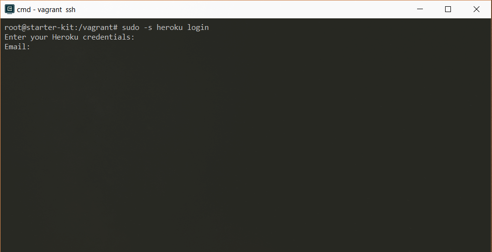

After login into Heroku via the command line, type the following command.
>
```bash
heroku create
```
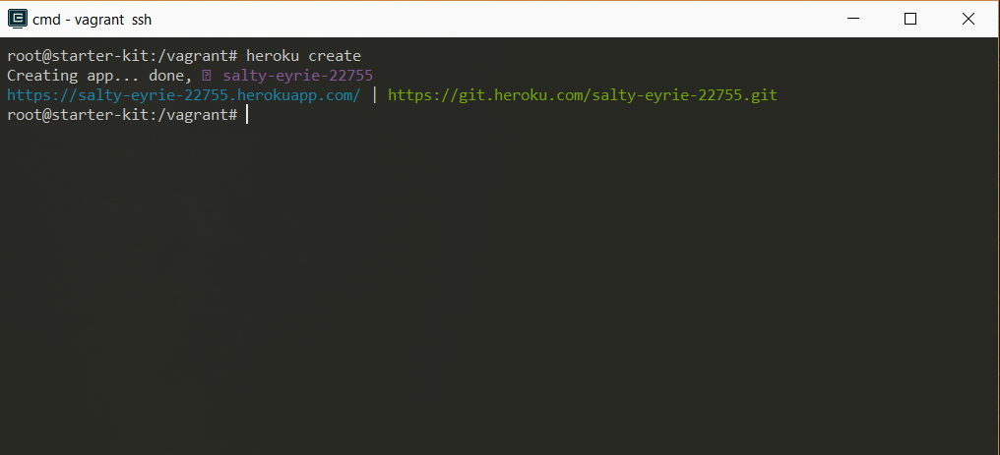

After creating the app, type the following command.
>
```bash
git push heroku master 
```
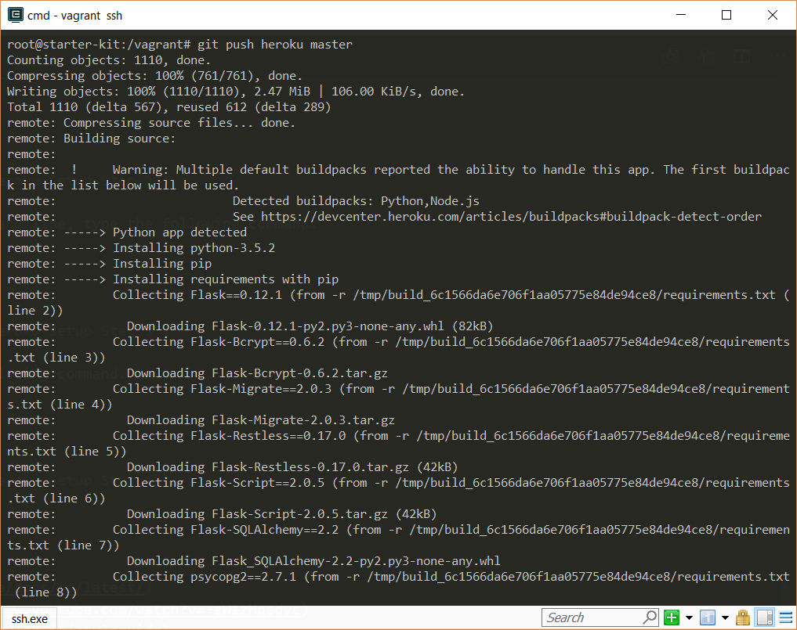

## Resources for Learning

### Angular 2
+ [Angular 2 Docs](https://angular.io/docs/ts/latest/)
+ [Angular 2 in 60 Minutes](https://www.youtube.com/watch?v=-zW1zHqsdyc)
+ [Angular 2 Style Guide](https://angular.io/styleguide)

### Flask
+ [Flask Website](http://flask.pocoo.org/)
+ [Flask-SQLAlchemy Docs](http://flask-sqlalchemy.pocoo.org/2.1/)
+ [SQLAlchemy Docs](http://www.sqlalchemy.org/)
+ [Flask-Restless Docs](https://flask-restless.readthedocs.io/en/stable/)
+ [Flask-Script Docs](https://flask-script.readthedocs.io/en/latest/)
+ [Flask-Migrate Docs](https://flask-migrate.readthedocs.io/en/latest/)
+ [Flask-Bcrypt Docs](https://flask-bcrypt.readthedocs.io/en/latest/)

### Bootstrap
+ [Bootstrap Website](http://getbootstrap.com/)
+ [Bootstrap Themes](https://bootswatch.com/)

### Heroku
+ [Heroku](https://heroku.com)
+ [Getting Started On Heroku With Python](https://devcenter.heroku.com/articles/getting-started-with-python#introduction)

## Additional Helpful Tools
+ [Visual Studio Code](https://code.visualstudio.com/)
+ [Cmder for Windows](http://cmder.net/)
+ [GitHub Desktop for Windows](https://desktop.github.com/)

## Frequently Asked Questions

#### 1. How do I run the application again after turning off my computer?
Follow steps 3 through 8 from above.

#### 2. I have made changes to a page, but browser is not displaying the changes.
Close the browser. Restart the application. Cancel the gulp command 
(press CTRL-C) and run the gulp command once again. Open the browser again 
and go to [http://localhost:3000](http://localhost:3000). If that does not fix
the issue, delete all the browser history and refresh the page again.